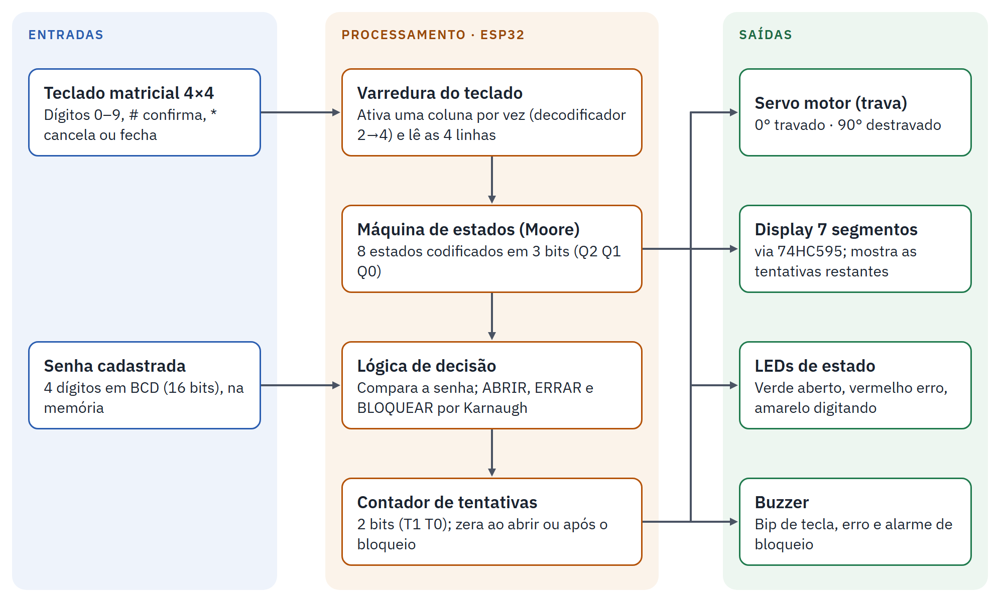
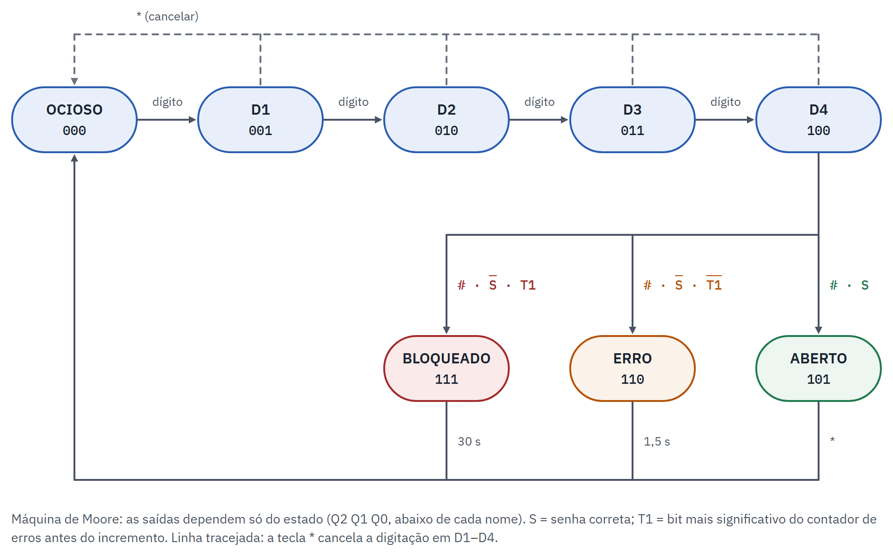

# Cofre Digital com Teclado Matricial e Máquina de Estados

Projeto Integrador da disciplina de **Sistemas Digitais** (UniRitter, 2026/2), desenvolvido por
**Arthur Schwambach** e **Henrique Braga Stortti de Souza**.

Cofre digital simulado no [Wokwi](https://wokwi.com) com um **ESP32**. O cofre só destrava com a senha correta de
4 dígitos e bloqueia o teclado por 30 segundos depois de 3 tentativas erradas seguidas.



## Funcionamento

- Digite a senha no teclado 4x4 e confirme com `#`. A tecla `*` cancela a digitação ou trava o cofre quando ele está aberto.
- **Senha correta:** o servo gira para 90° (destravado) e o LED verde acende.
- **Senha errada:** o LED vermelho acende e o buzzer toca por 1,5 s, e o display mostra uma tentativa a menos.
- **Terceiro erro seguido:** bloqueio de 30 s, com display em 0, LED vermelho e alarme piscando. O teclado é ignorado.
- Senha de teste: **2580**.

## Conteúdos aplicados

| Conteúdo | Onde |
|---|---|
| Máquina de estados (Moore) | 8 estados codificados em 3 bits (Q2 Q1 Q0) |
| Tabela-verdade e mapa de Karnaugh | `ABRIR = C·S`, `ERRAR = C·S'·T1'`, `BLOQUEAR = C·S'·T1` e saídas dos LEDs |
| Contador | Tentativas erradas em 2 bits (T1 T0) |
| Decodificador | Display de 7 segmentos (mostra 3 − T) e seleção de colunas do teclado |
| Sistemas de numeração | Senha guardada em BCD (`0x2580`) |
| Circuitos sequenciais | Máquina de estados, contador e registrador de deslocamento 74HC595 |



| Estado | Código | Saídas |
|---|---|---|
| OCIOSO | 000 | cofre travado |
| D1 a D4 | 001 a 100 | LED amarelo (digitando) |
| ABERTO | 101 | servo a 90° e LED verde |
| ERRO | 110 | LED vermelho e buzzer por 1,5 s |
| BLOQUEADO | 111 | LED vermelho e alarme piscando por 30 s |

## Ligações no ESP32

| Componente | Pinos |
|---|---|
| Teclado 4x4: linhas R1–R4 | GPIO 13, 14, 27, 26 |
| Teclado 4x4: colunas C1–C4 | GPIO 25, 33, 32, 23 |
| 74HC595 (DS / SH_CP / ST_CP) | GPIO 16 / 4 / 17 |
| Servo SG90 | GPIO 18 |
| LEDs verde / vermelho / amarelo | GPIO 19 / 21 / 22 |
| Buzzer | GPIO 5 |

## Como rodar

1. Abra um projeto ESP32 novo no Wokwi: https://wokwi.com/projects/new/esp32
2. Substitua o conteúdo de `sketch.ino` e `diagram.json` pelos arquivos da pasta [`wokwi/`](wokwi).
3. No *Library Manager*, adicione as bibliotecas **Keypad** e **ESP32Servo** (ou crie o arquivo `libraries.txt`).
4. Clique em ▶ e abra o Serial Monitor, que mostra cada tecla e cada mudança de estado.

A lógica de decisão em portas lógicas está em [`logisim/cofre_decisao.circ`](logisim) (Logisim Evolution 3.8).

## Testes

Todos os testes foram aprovados. As evidências estão em [`docs/testes/`](docs/testes).

| Teste | Cenário | Resultado |
|---|---|---|
| 1 | Digitação e cancelamento | Aprovado |
| 2 | Senha correta e fechamento | Aprovado |
| 3 | Senha errada | Aprovado |
| 4 | Bloqueio após três erros | Aprovado |
| 5 | Zeramento do contador após acerto | Aprovado |
| 6 | Confirmação com menos de 4 dígitos | Aprovado |
| 7 | Lógica de decisão no Logisim | Aprovado |

## Estrutura

```
wokwi/      código do ESP32 (sketch.ino), circuito (diagram.json) e bibliotecas
logisim/    circuito da lógica de decisão e tabela-verdade gerada pelo Logisim
docs/       diagramas do projeto e prints dos testes
```
